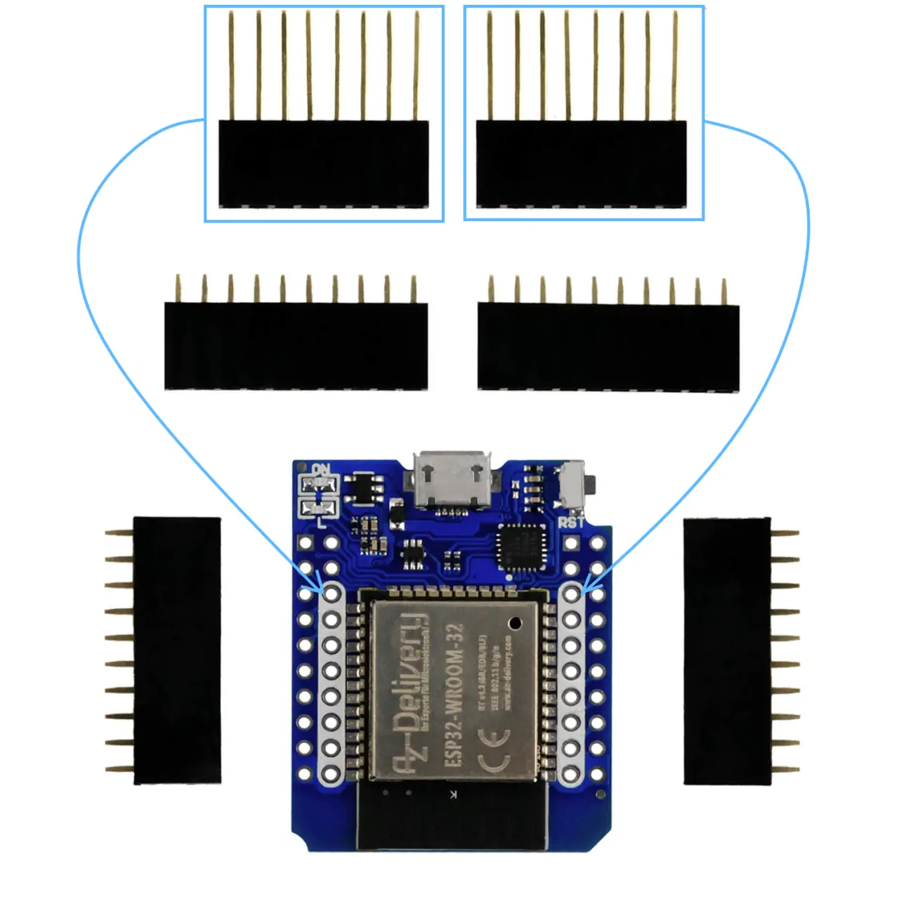

# az-touch-templates

Templates de code PlatformIO et retour d'expérience sur l'assemblage du kit AZ-Touch MOD vendu par AZ-delivery.

## Documentation disponible

Le modèle testé est celui-ci : https://www.az-delivery.fr/products/az-touch-wandgehauseset-mit-2-8-zoll-touchscreen-fur-esp8266-und-esp32

Le kit semble avoir été conçu par Zihatec.de (qui porte visiblement aussi le nom hwhardsoft.de). La doc disponible regroupe :
* [Une page web](https://www.hwhardsoft.de/english/projects/arduitouch-esp/) avec des archives zip contenant des projets Arduino
* [Un compte github](https://github.com/HWHardsoft/) avec plusieurs repositories

## Assemblage

L'assemblage est décrit sur [le blog AZ-delivery](https://www.az-delivery.de/fr/blogs/azdelivery-blog-fur-arduino-und-raspberry-pi/az-touch-mod). Point atypique : les barrettes femelles permettant de connecter l'ESP32, surnommées _caterpillar connectors_, ont leurs connecteurs soudés de part et d'autre de la barrette, et non sous la barrette :

L'ESP32 doit être enfiché dans ces barrettes **par l'arrière**, contrairement à l'écran qui est sur la face avant.

## Composants

La board intègre un régulateur 5V LM2576R-05 et peut normalement être alimentée avec une tension continue entre 9V et 35V via le bornier bleu.

L'écran, sa couche tactile et la carte SD sont tous les 3 acessibles en SPI avec des lignes CS (_chip select_) dédiées. Les microcontrôleurs utilisés sont :
* écran: ILI9341
* couche tactile : XPT2046

L'écran est rétro-éclairé par une LED connectée à un GPIO de l'ESP. Sa luminosité peut donc être ajustée en modifiant la valeur écrite sur le GPIO (qui fonctionne alors en PWM).

Enfin, l'ESP32 peut piloter un buzzer (sur quel GPIO ? peut-on faire varier sa fréquence ?)

## Avec ESP32 devkit C4

Liens vers l'article :
* soudé : https://www.az-delivery.fr/products/esp-32-dev-kit-c-v4
* non soudé : https://www.az-delivery.fr/products/esp32-dev-kit-c-v4-unverlotet

**Attention :** je n'ai pas réussi à faire fonctionner le kit avec un ESP32 dev kit car 1/3 des pins de l'ESP32 ne font pas contact. La faute aux connecteurs mâles qui sont trop courts pour aller jusqu'aux contacts des _caterpillar connectors_ après avoir traversé le PCB.

J'ai perdu beaucoup de temps à vérifier toutes les configurations soft possibles avant de tester la continuité des pistes, découvrant ainsi le problème de contact.

## Avec ESP32 D1 Mini

Lien vers l'article :
* non soudé : https://www.az-delivery.fr/products/esp32-d1-mini

Pour l'assemblage, il faut souder les connecteurs femelles **avec les longues pattes** sur les GPIOs intérieurs (blancs). 

Les GPIOs sont alors reliés ainsi aux différents modules :

| Touch screen | GPIO |
|-------|------|
| IRQ | 16 |
| D0 | 19 |
| DIN  | 23 |
| CS | 5 |
| CLK  | 18 |

| Display | GPIO |
|-------|------|
| LED | 5 |
| SCK | 18 |
| MOSI  | 23 |
| DC | 21 |
| RESET  | Reset |
| CS | 22 |

| Beeper | GPIO |
|-------|------|
| Beeper | ?? |